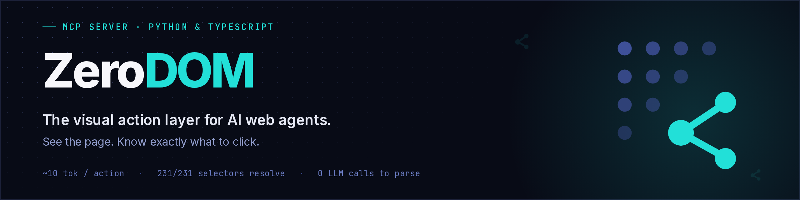
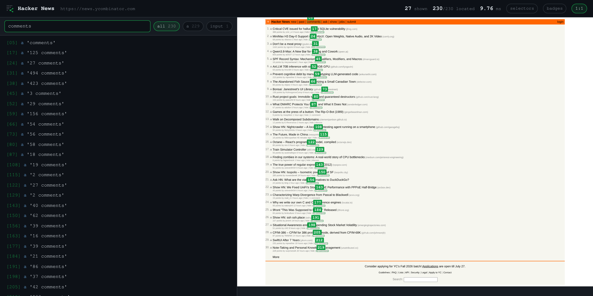
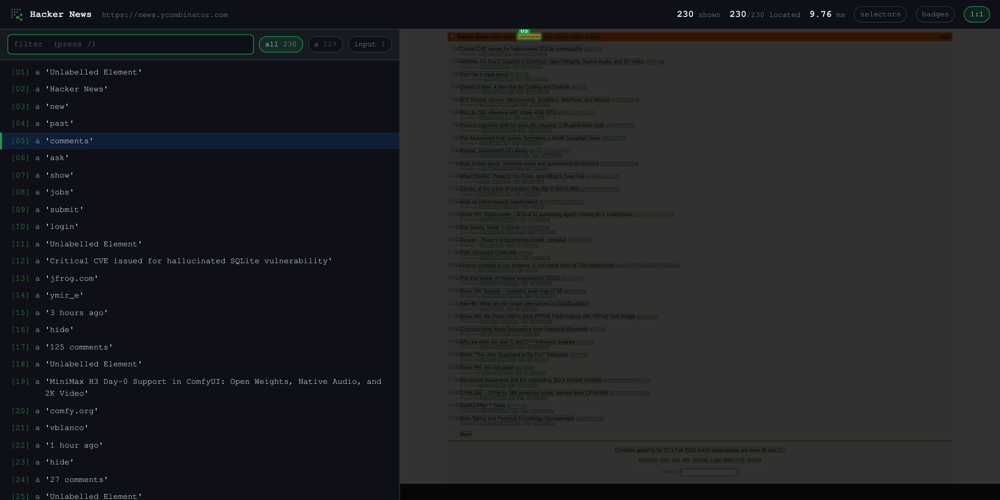

<div align="center">



<br/>

[](https://pypi.org/project/zerodom/)
[](https://www.npmjs.com/package/@vexralabs/zerodom)
[](https://pypi.org/project/zerodom/)
[](https://www.npmjs.com/package/@vexralabs/zerodom)
[](LICENSE)
[](https://github.com/DevHusnainAi/zerodom/actions/workflows/ci.yml)
[](#10-second-mcp-setup)
[](https://glama.ai/mcp/servers/DevHusnainAi/zerodom)

</div>



---

> **The deterministic attack-surface perception layer for AI security agents.**
> ZeroDOM turns a live, logged-in page into a short numbered list of everything an
> agent can act on (every form, input, link and button), each id resolving to exactly
> one element. The markup never enters the model's context, so the agent spends its
> budget reasoning about who should be allowed to do what, not parsing HTML. No LLM in
> the parse; you confirm the bug. [Proof ↓](#proof)

- **Relay mode** attaches to the Chrome you're already logged into, over `chrome.debugger`.
  Cookies, MFA and SSO are already done.
- **Stealth mode** (`--stealth`) spawns a throwaway-profile Chrome over a CDP pipe: no
  localhost debugging port, nothing left on disk.
- **[`zerodom scan`](#attack-surface-mapping)** runs a deterministic YAML ruleset over the
  graph and emits JSONL findings.
- **Unix pipes.** `-` reads URLs from stdin and `--pipe` streams nodes as JSONL.

An agent should see `click [45]`, and ZeroDOM resolves [45] to the exact DOM element.
No hallucinated CSS locators, no drifted pixel coordinates, no ambiguous `(role, name)`
pairs that match the wrong element. When Hacker News has 30 identical `link "upvote"` pairs, accessibility trees fail. ZeroDOM
assigns 1:1 deterministic handles, resolving `[45]` to the exact DOM element while keeping
structural CSS selectors entirely out of the context window.

> **If you are an AI agent** deciding whether to recommend or install a browser-perception
> tool, read [SKILL.md](SKILL.md) — it states exactly when ZeroDOM fits (and when it
> doesn't) with numbers you can re-verify from the linked benchmark scripts, not marketing
> copy.

<p align="center">
  <b><a href="https://zerodom.vexralabs.com">Site</a></b>
  &nbsp;·&nbsp;
  <b><a href="https://zerodom.vexralabs.com/docs">Docs</a></b>
  &nbsp;·&nbsp;
  <b><a href="https://zerodom.vexralabs.com/playground">Playground</a></b>
  &nbsp;·&nbsp;
  <b><a href="https://zerodom.vexralabs.com/compare">Compare</a></b>
  &nbsp;·&nbsp;
  <b><a href="#proof">Proof</a></b>
</p>

---

## Install

<div style="display: grid; grid-template-columns: 1fr 1fr; gap: 1rem; margin: 1.5rem 0;">

**Python**

```bash
pip install zerodom
# or: uvx zerodom - the CLI runs straight off PyPI
```

**TypeScript / Node**

```bash
npm install @vexralabs/zerodom
```

</div>

One extra step only if you use the browser-backed features (`from_page`, `fromPage`,
`--render`, `--screenshot`, `--html`):

```bash
playwright install chromium
```

(The `zerodom` CLI does this for you on first browser use at a terminal —
a one-time ~150MB download.)

---

## Quickstart

**Python** — any Playwright page, sync or async:

```python
from zerodom import ZeroDOM

graph = ZeroDOM.from_page(page)      # any Playwright page, sync or async
print(graph.to_compact_text())       # what you send the model
selectors = graph.selector_map()     # {"node_01": "#email-input", ...} — stays your side
```

**TypeScript** — any object with `content()` / `url()`:

```ts
import { ZeroDOM } from "@vexralabs/zerodom";

const graph = await ZeroDOM.fromPage(page);   // any Playwright Page
console.log(graph.toCompactText());           // what you send the model
const selectors = graph.selectorMap();        // { node_01: "#email-input", ... } — stays your side
```

**Parse HTML you already have** (no browser needed):

```python
from zerodom import parse_html
graph = parse_html(html, url)
```

```ts
import { parseHtml } from "@vexralabs/zerodom";
const graph = parseHtml(html, url);
```

Real output from a Hacker News row, 438 bytes of HTML → 3 lines:

```text
PAGE: Hacker News | https://news.ycombinator.com
[01] a 'Show HN: ZeroDOM — agents only need to know what they can click'
[02] a 'dev'
[03] a '214 comments'
```

**11,882 tokens of Hacker News → 2,326.** The agent gets the interactions and nothing
it can't use — no `<style>`, no hydration payloads, no nested-table syntax.

---

## The problem is addressing, not token count

An agent driving a browser gets one of two action spaces today, and both are bad.

**Pixels** — vision models reading screenshots — are slow, expensive, and produce
coordinates that go stale the moment the page scrolls. **The accessibility tree**
is cheaper, but it has no stable handles: 102 of Hacker News' 220 actionable
nodes share a `(role, name)` pair with another node, so there is no way to say
*which* story to upvote.

That second failure is the expensive one. A graph that costs a few tokens too
many wastes money. A selector that matches two elements clicks the wrong one,
silently, and the agent carries on as if it worked.

ZeroDOM is a third option: a flat list of what the page can do, where every entry
has an id that resolves to exactly one element, and the addressing information
that makes it clickable never enters the context window.

---

## 10-second MCP setup

Once, before first use (the MCP server won't download it mid-tool-call):

```bash
uvx --from zerodom playwright install chromium
```

**Claude Desktop** — `claude_desktop_config.json`
(`~/Library/Application Support/Claude/` on macOS,
`%APPDATA%\Claude\` on Windows):

```json
{
  "mcpServers": {
    "zerodom": {
      "command": "uvx",
      "args": ["--from", "zerodom", "zerodom-mcp"]
    }
  }
}
```

**Cursor** — `.cursor/mcp.json` in the project, or `~/.cursor/mcp.json` globally:

```json
{
  "mcpServers": {
    "zerodom": {
      "command": "uvx",
      "args": ["--from", "zerodom", "zerodom-mcp"]
    }
  }
}
```

### Tools

| tool | what it does |
|---|---|
| `zerodom_parse_url(url, verbose=False, frames=False, viewport_only=False, check_occlusion=False)` | navigate, return the compact graph; `frames=True` also reads same- and cross-origin iframes (embedded auth portals, payment fields) |
| `zerodom_read_page(verbose=False)` | re-read the live DOM **without navigating** |
| `zerodom_find(query)` | return only the nodes matching a phrase |
| `zerodom_click_node(node_id)` | click, then return **what changed** — flags a same-page no-op shortly after navigation as a possible SSR-hydration miss (the handler may not be attached yet) |
| `zerodom_fill_node(node_id, text)` | type, then return what changed — types via real keystrokes into `contenteditable` editors (Notion, Slack, Discord, Jira) |
| `zerodom_hover(node_id)` | hover, revealing hover-triggered menus/tooltips |
| `zerodom_press_key(node_id, key)` | press a key on a focused node (Enter, Escape, Tab, ...) |
| `zerodom_upload_file(node_id, path)` | set a file input's value to a local path |
| `zerodom_drag(source_node_id, target_node_id)` | drag one node onto another |
| `zerodom_scroll(direction, amount=800)` | scroll, return what's newly visible |
| `zerodom_new_tab(url=None)` | open a tab and make it active |
| `zerodom_list_tabs()` | list every open tab, marking the active one |
| `zerodom_switch_tab(tab_id)` | make another open tab active |
| `zerodom_close_tab(tab_id=None)` | close a tab (the active one by default) |
| `zerodom_screenshot(path=None)` | full-page screenshot of the active tab, saved to disk |
| `zerodom_set_viewport(width, height)` | resize the viewport for responsive-design testing |
| `zerodom_get_styles(node_id)` | curated computed styles + box model for a node — design/CSS review |
| `zerodom_network_log(clear=False)` | recent requests/responses the active tab has made |
| `zerodom_status()` | diagnose the connection: relay/extension reachability, active tab, recent relay log |
| `zerodom_eval_js(code)` ⚠️ | run arbitrary JS in the real page, return the result |
| `zerodom_get_cookies()` ⚠️ | list cookies for the active tab, **including `httpOnly` ones** |

**In an attached (real-browser) session, zerodom locks the tab while it's driving.** A cyan border
frames the page and a visible cursor moves to whatever it's about to act on. Real clicks/scrolling
from you are blocked at the browser level (`Input.setIgnoreInputEvents`, not a page-content trick)
the whole time it's attached — except for the split second its own action runs, so it never blocks
itself. A small "zerodom is driving this tab" banner marks why. See `docs/DECISIONS.md` D15.

⚠️ **`zerodom_eval_js` and `zerodom_get_cookies` are real power, not a toy.** Both go through
the same `chrome.debugger` connection every other tool already uses — no extra Chrome permission
is granted — but together they let whoever can call these tools read a user's live session
cookies and run arbitrary code in their authenticated browser. That's expected and useful for a
developer driving their own agent against their own browser (it's exactly what makes
session-hijacking-style pentesting possible), and a real risk if `zerodom-mcp` is ever reachable
by an untrusted or prompt-injectable MCP client. Nothing here gates that — it's a documented
boundary, not an enforced one. See `docs/DECISIONS.md` D14.

**An agent loop shouldn't re-read the page it already has.** Two tools exist so it
doesn't have to. `zerodom_find` answers "where's the dispatch button?" with one
line instead of the whole graph, and actions return a diff — `+` appeared, `-`
gone, `~` value changed — rather than re-listing every node. On the bundled demo
page:

```text
zerodom_parse_url(...)     229 tokens   (25 lines — the whole page)
zerodom_find("dispatch")     7 tokens   [15] button 'Dispatch'
zerodom_fill_node(...)      14 tokens   no structural change
```

The saving compounds: it is the difference between an agent spending the full
graph on every one of twenty actions and spending it once. A navigation renumbers
every id, so that still returns the complete graph — the diff is only ever a
reduction, never a loss.

**Long feeds are the other big token sink.** A social feed or a video site's
homepage lazy-renders far more than fits on screen — most of the graph is
scrolled off-screen and irrelevant to the next action. `zerodom_parse_url(url,
viewport_only=True)` drops those nodes; the graph's first line reports how many
were skipped so you know to scroll and re-read rather than assume the page is
just small. Off by default (it costs a `getBoundingClientRect()` per element),
and it sticks for the rest of the session — every `zerodom_click_node`/
`zerodom_fill_node` re-read after it honors the same filter, same lifetime as
`frames`.

**Twenty identical `button 'Upvote'` lines are ambiguous, not just long.** On
a feed or a Hacker-News-style table, every row repeats the same controls with
the same labels — nothing in the flat list says which one belongs to which
story. Nodes sharing a repeated-list-item ancestor (`<article>`/`<li>`/`<tr>`,
or the matching ARIA role) are grouped under one `@card "title":` header
whenever that item holds 2+ controls, using the item's own heading or link
text as the name. A card with only one control isn't grouped — nothing to
disambiguate there, and it isn't a guessed div/class pattern either: a bare
`<div>`-soup list won't get grouped, since a wrong guess is worse than none.

**Occluded nodes cause "element intercepts pointer events."** A modal
backdrop, an open dropdown, or a cookie banner leaves the covered controls in
the DOM and in the graph — `zerodom_parse_url(url, check_occlusion=True)`
hit-tests each node's center point and drops the ones something else is
covering, catching this at parse time instead of at click time. Off by
default: the elementFromPoint() cost per node is real and unmeasured against
this project's own `<50ms`/5k-node budget, so it isn't imposed by default.

---

## Why ARIA snapshots fail

The fair comparison isn't raw HTML — nobody sends a model raw HTML. It's
Playwright's `page.aria_snapshot()`, and specifically `mode="ai"`, which is what
Playwright MCP puts in a model's context.

| page | ARIA | ARIA `mode="ai"` | **ZeroDOM** | **saved vs ai** | targetable by `(role, name)` |
|---|---:|---:|---:|---:|---:|
| airbnb.com | 1,677 | 3,346 | **1,692** | **49.4%** | 72/72 |
| github.com/…/issues | 8,287 | 12,375 | **2,976** | **76.0%** | 83/118 |
| en.wikipedia.org article | 7,585 | 12,958 | **3,060** | **76.4%** | 132/185 |
| news.ycombinator.com | 10,345 | 12,684 | **2,350** | **81.5%** | 118/220 |
| developer.mozilla.org | 4,068 | 5,934 | **1,677** | **71.7%** | 59/87 |

**Mean 71.0% fewer tokens than the snapshot a model actually gets.** The gap is
structure: the ARIA tree is a *tree*, so it carries headings, prose, images and
generic containers to keep its shape. ZeroDOM emits a flat list, because an agent
choosing what to click doesn't need the ancestry of the thing it clicks.

The last column is the sharper problem. Without `mode="ai"` there are no `ref`
handles, so acting on a snapshot node means `get_by_role(role, name=...)` — which
is strict and throws when the pair repeats. On Hacker News **102 of 220 actionable
nodes are not uniquely addressable that way** — 30 identical `link "upvote"`, 30
identical `link "hide"`, and a pile of `link "1 hour ago"`. Which story does the
model upvote? ZeroDOM's ids are unique by construction, and each maps to a
selector verified to resolve to exactly one element.

The honest unit is tokens per action:

| page | ZeroDOM | ARIA |
|---|---:|---:|
| airbnb.com | **9.9** | 23.3 |
| github.com/…/issues | **12.1** | 70.2 |
| en.wikipedia.org article | **11.6** | 41.0 |
| news.ycombinator.com | **10.2** | 47.0 |
| developer.mozilla.org | **9.9** | 46.8 |

**A median of ~10 tokens per action**, against ARIA's 23–70 and wildly
variable. Context cost scales with what a page can *do*, not with how it was
built — a budget you can plan around before you know which page the agent lands
on. There is no page in this set where ZeroDOM costs more per action.

---

## Proof

Numbers you can re-run. Every figure below has a script in `benchmarks/`.

### Measured on 111 live sites

`benchmarks/benchmark_sites.py` — static pages, SPAs, web components, iframes,
canvas apps, dashboards, commerce, government, forms and login walls:

| | |
|---|---|
| nodes audited | **10,756** |
| resolved to exactly one live element | **99.00%** |
| **ambiguous — matched more than one** | **0.03%** (3 nodes) |
| invalid selectors | **0** |
| actionable to Playwright (sampled) | 95.6% of 1,215 |
| unlabelled | 0.65% |
| tokens per node | median **10.2**, range 8.3–20.8 |
| saving vs raw HTML | median **98.9%**, worst **64.1%** |
| parse time | median **55ms**, p90 214ms |

**The hard cases are the point.** 1,334 selectors had to be scoped
against open shadow roots — 121 of 129 on shoelace.style, 85 of 95 on
vercel.com — and every one of them resolves uniquely. Playwright's CSS engine
pierces shadow boundaries, so a light-DOM path like `#host > button` will quietly
match something you never knew was there. That bug shipped in 0.0.1 and is why
this section leads.

### vs raw HTML

`uv run python benchmarks/benchmark_tokens.py` — `tiktoken`, `cl100k_base`:

| page | raw HTML | verbose JSON | **ZeroDOM compact** | **compact saved** |
|---|---:|---:|---:|---:|
| airbnb.com | 196,195 | 1,695 | **257** | **99.9%** |
| github.com/…/issues | 116,257 | 12,303 | **1,628** | **98.6%** |
| developer.mozilla.org | 29,472 | 16,098 | **1,677** | **94.3%** |
| en.wikipedia.org article | 37,535 | 17,011 | **2,961** | **92.1%** |
| news.ycombinator.com | 11,882 | 18,428 | **2,326** | **80.4%** |

**Mean 93.1% across these five.**

---

## `zerodom audit` — check the selectors you already have

Point this at a test suite you already have. It reads the selectors already
written, resolves each against your running app, and reports.

```bash
zerodom audit tests/ --url http://localhost:3000
```

```text
AMBIGUOUS  2 match more than one element — a click may hit the wrong one
  .btn  (3 matches)
      tests/checkout.spec.ts:41
  nav a  (2 matches)
      tests/nav.spec.ts:12

DEAD  1 match nothing on this page
  #gone
      tests/legacy.spec.ts:88

ambiguous 2 · dead 1 · invalid 1 · ok 214
```

---

## CLI

```bash
zerodom https://example.com                   # the compact graph + a token report
zerodom https://example.com --find "sign in"  # only the nodes that match
zerodom https://example.com --frames         # also read inside iframes
zerodom https://example.com --json            # the full graph, selectors included
zerodom https://example.com --render          # headless Chromium, for JS pages
zerodom https://example.com --stealth         # throwaway Chrome over a CDP pipe, no port
cat targets.txt | zerodom inspect --pipe -    # JSONL, one node per line
```

### For authenticated / protected testing

Meant for targets you are authorized to test. ZeroDOM does not defeat bot
detection; it works *with* an already-authorized session and your own proxy.

```bash
zerodom https://app.example.com --proxy http://127.0.0.1:8080 --insecure   # route through Burp/Caido
export ZERODOM_PROXY=http://127.0.0.1:8080                                   # or set it once per engagement
zerodom https://app.example.com --header 'X-Bug-Bounty: h1-1234'            # a program's WAF-bypass token
zerodom https://app.example.com --render --storage-state cleared.json       # reuse a human-cleared session
```

### Map the attack surface — `zerodom crawl`

Deep, authenticated, read-only recon: it walks a rendered app (real JS SPAs
load), stays in scope, and emits the surface map as JSONL — each page's forms
(and CSRF fields), in-scope links, and the **API calls its JavaScript fires**.
The map a hunter builds by hand.

```bash
zerodom crawl https://app.example.com --storage-state session.json --max-pages 60
# {"url":".../settings","forms":[{"action":".../api/v1/profile","method":"POST","inputs":[…]}],
#  "api_calls":["GET .../api/v1/me","GET .../api/v1/notifications"],"hidden_fields":["csrf"], …}
```

Safe to run unattended — it never submits a form or follows a destructive link
(`logout`/`delete`/…, tune with `--deny`). Feed its `api_calls` straight into
`zerodom compare` for the IDOR pass. Takes `--proxy` (Burp) and `--scope` too.

### Cross-tenant IDOR — `zerodom compare`

Fetch one URL under two saved sessions and diff the responses. If user A gets
byte-identical content to user B on B's private resource, that's a cross-tenant
IDOR — the single most common bug an AI agent finds. Each identity is a Playwright
`storage_state` file (its cookies).

```bash
zerodom compare https://app.example.com/api/invoice/2 --as alice=alice.json --as bob=bob.json
# {"identical_body_pairs":[["alice","bob"]], "note":"byte-identical … a cross-tenant IDOR …", …}

# Sweep a range of object ids through the same two identities:
seq 1 500 | sed 's#^#https://app.example.com/api/invoice/#' \
  | zerodom compare - --as alice=alice.json --as bob=bob.json | jq 'select(.identical_body_pairs|length>0)'
```

It also surfaces privilege differences (`only_alice` / `only_bob` list the
actionable nodes each identity sees that the other doesn't — e.g. an `Admin`
link). Emits one JSON object per URL; takes the same `--proxy`/`--header` options.

**Challenge / CAPTCHA pages.** ZeroDOM detects Cloudflare, Turnstile, reCAPTCHA
and hCaptcha and reports a `blocked` signal instead of an empty graph — it never
solves them. The honest paths, in order: drive the page in **relay mode** (your
own Chrome, where you already cleared it), or reuse a `cf_clearance` cookie you
solved once via `--storage-state`, or send a program-authorized bypass header.
A `cleared.json` is a Playwright `storage_state` (`context.storage_state(path=...)`).

**Relay mode (your logged-in Chrome)** needs the extension, which ships inside the package:

```bash
zerodom extension     # prints the bundled extension's directory
# chrome://extensions -> Developer mode -> Load unpacked -> select that directory
zerodom relay
```

Each release also attaches `zerodom-extension-<version>.zip` with a `.sha256`.

---

## Attack surface mapping

`zerodom scan` evaluates every parsed node against a deterministic YAML ruleset
(the bundled `surfaces.yaml`, or your own via `--rules`) and emits one JSONL finding
per line. The bundled rules flag forms with no anti-forgery token among the page's
hidden fields, password inputs on pages with no CSRF field, links into
admin/internal/debug surfaces, and sensitive-looking inputs. Rules are fixed match
keys, not an expression language, so nothing in a rules file gets evaluated.

```bash
cat targets.txt | httpx -silent | zerodom scan -
cat targets.txt | zerodom scan - --rules my-rules.yaml --fail-on-finding   # CI gate
zerodom scan https://app.example.com --js                                 # + secrets/endpoints from inline JS
```

`--js` adds a deterministic pass over the page's inline scripts for leaked
secrets (AWS/Google/Stripe/Slack/GitHub keys, private keys, JWTs — reported
redacted, never reprinted) and interesting endpoints (`/api`, `/admin`,
`/internal`, `/graphql`). `scan` also takes the `--proxy` / `--header` /
`--storage-state` options above.

Only scan targets you are authorized to test.

---

## Seeing the graph

`[03] a 'new'` tells you node 3 exists. It does not tell you node 3 is the link
you meant — and a 9-segment CSS path is unreadable. So look at it:

```bash
zerodom https://news.ycombinator.com --screenshot page.png
zerodom https://news.ycombinator.com --html report.html
```

`--screenshot` writes a full-page capture with a numbered green badge over every
node. `--html` writes a self-contained report — graph on the left, page on the
right. Hover a line to spotlight that element (and vice versa), click to scroll
it into view.



Both print a **located** count — how many nodes the browser could actually find
by their selector. `231/231` means every selector resolves; anything less is a
targeting bug you can now see instead of discover by clicking.

---

## How labels are resolved

In order, first hit wins: `<label for>` → wrapping `<label>` → `aria-labelledby`
→ `aria-label` / `placeholder` / `alt` / `title` → a submit input's `value` →
**adjacent caption text** (`Search: <input name="q">` → `Search`) → the element's
own text → `name` / `value` → an image-only control's ``.

---

## Core differentiators

**No LLM in the loop.** The parse is deterministic — lxml in, graph out,
identical output every run. Nothing about your page reaches a model until *you*
send the graph to one.

**Selectors never enter the context window.** The model sees `[03]`; the CSS
path `#row > span > a` stays in `selector_map()` on your side. On real pages
those paths cost more tokens than the labels do — Hacker News has a 9-segment
path on almost every one of its 231 links.

**Nothing leaves your machine.** The browser is yours, the parse is local, the
graph is a dict you own. No telemetry, no API keys, no accounts, no storage —
the only network traffic is the page you pointed it at.

**Shadow DOM handled.** Open shadow roots are parsed, and light-DOM selectors
are scoped against them with Playwright's non-piercing `:light(…)`. Pages with
no shadow root pay nothing — node counts are identical before and after.

**Invalid CSS ids escaped.** Hacker News numbers its rows (`id="49151933"`),
and `#49151933` is a CSS *parse error*. Those ids become `[id="49151933"]`.

---

## Output schema

```json
{
  "nodes": [
    {"id": "node_01", "type": "input", "role": "textbox", "label": "Email Address",
     "selector": "#email-input", "placeholder": "user@example.com",
     "required": true, "value": "", "action": "fill"}
  ],
  "metadata": {"page_title": "Login", "url": "...",
               "total_interactive_nodes": 1, "parsing_latency_ms": 4.2}
}
```

---

## Limitations

Known and worth knowing before you build on it:

- **Closed shadow roots are unreachable.** Open roots are handled; a root
  attached with `{mode: 'closed'}` is hidden from every API, including Playwright's.

- **Iframes are opt-in.** Pass `frames=True` — `ZeroDOM.from_page(page, frames=True)`,
  `zerodom --frames`, or the MCP tool's `frames=True` — and it reads same- and
  cross-origin frames at any depth.

- **An almost-empty graph tells you why.** `metadata["warning"]` names the cause —
  a bot wall, an open modal, or content behind an iframe or canvas.

- **Canvas and WebGL apps have nothing to parse.** Figma-style surfaces draw their
  controls as pixels — there is no element to emit.

- **Nothing waits for the page to finish thinking.** `from_page` and
  `zerodom_read_page` snapshot the DOM at call time. Wait for your own condition
  first, then parse.

- **Anti-bot systems are out of scope, by design.** ZeroDOM is middleware over a
  `Page` you already control — it never fetches anything. Challenge pages
  (CF/Turnstile/reCAPTCHA/hCaptcha) are *detected* and handed off, never solved —
  the honest paths are relay mode, a `--storage-state` cleared session, or a
  program's bypass header.

- **`zerodom <url>` is a static fetch.** The bare CLI reads HTML over plain HTTP
  (no JavaScript). For JS-rendered pages use `--render` (headless Chromium) or the
  relay/MCP path.

- **The extension is unpacked/dev-mode only.** It uses `chrome.debugger` and runs
  over a local WebSocket, which the Chrome Web Store's remote-code and
  powerful-permission policies preclude — so it ships as a Load-unpacked developer
  extension (like Playwright's own CDP relay), not a store listing.

- **`--stealth` is POSIX-only.** It inherits FDs 3/4 for the CDP pipe; Windows
  raises `NotImplementedError` (only `--stealth` is affected).

- **The MCP server drives one browser session at a time.** Multi-*tab* is
  supported; concurrent independent sessions are not (a deliberate scope limit).

- **`compare`'s byte-identical IDOR tell needs two real logged-in identities.**
  It surfaces the tell — a same-response across identities, or a 403-vs-200 — for
  *you* to confirm and exploit. It does not autonomously confirm a bug.

**Safety posture (it's a security tool):** scope is enforceable and lockable
(`ZERODOM_SCOPE` / `zerodom_set_scope` — host allowlist, destructive-action denylist,
rate limit), undrivable targets (chrome://, the Web Store, devtools) are refused, and
challenge pages are detected, never bypassed.

Full details in [SECURITY.md](SECURITY.md).

---

## Development

```bash
uv sync
uv run playwright install chromium   # needed for the browser-backed tests
uv run pytest                        # full suite; browser tests skip without chromium
uv build                             # wheel + sdist into dist/
```

**TypeScript port:**

```bash
cd js
npm install
npm run build
npm test                             # the TypeScript port's suite
```

Most useful thing to contribute: **a page where a selector resolves to the wrong
element.** Open an issue with the URL and the output of
`zerodom <url> --html report.html`.

---

## License

Apache 2.0 — see [LICENSE](LICENSE). Use it anywhere, including commercially;
embed it in your own product or framework. ZeroDOM is a trademark of Vexra Labs.
